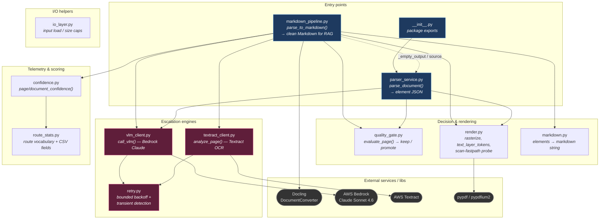
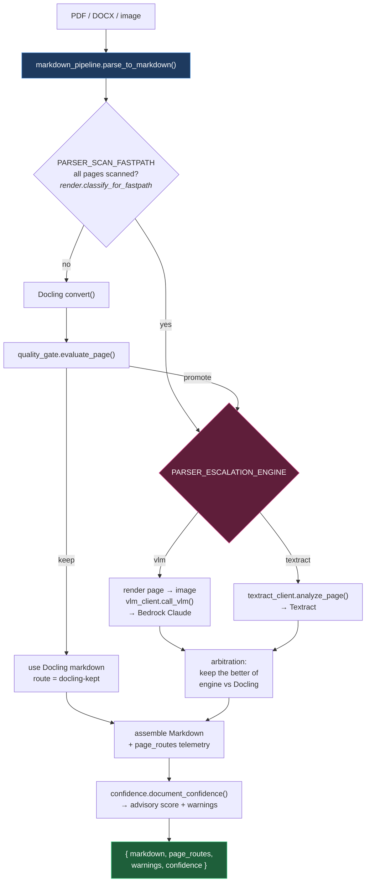

# parser_service — module architecture

How the modules in `src/parser_service/` relate. Two views: a **dependency graph**
(who imports whom) and a **runtime flow** (how one page moves through the system).
Edges below were traced from the actual intra-package imports.

## 1. Module dependency graph

### Module roles

| Module | Role | Depends on (intra-package) |
|---|---|---|
| **markdown_pipeline.py** | The orchestrator — Docling-first → escalation → Markdown. The hub. | `quality_gate`, `render`, `markdown`, `vlm_client`, `textract_client`, `confidence`, + `parser_service` (source / empty-output) |
| **parser_service.py** | The older JSON entry point (element JSON output) | `quality_gate`, `render`, `vlm_client` |
| **quality_gate.py** | Decides `keep` vs `promote_to_vlm` per page | *(leaf)* |
| **render.py** | Rasterizes pages, counts text tokens, scan-fastpath image probe | *(leaf; uses pypdf / pypdfium2)* |
| **vlm_client.py** | Bedrock Claude escalation engine | `retry` |
| **textract_client.py** | Textract escalation engine | `retry` |
| **retry.py** | Shared exponential-backoff + transient-error helper | *(leaf)* |
| **confidence.py** | Advisory page/doc confidence scoring | `route_stats` (route vocabulary) |
| **route_stats.py** | Route-name constants + CSV telemetry schema | *(leaf; also consumed by scripts)* |
| **markdown.py** | Renders elements → Markdown text | *(leaf)* |
| **io_layer.py** | Input loading / byte-size handling | *(leaf)* |

> Note: `markdown_pipeline` only *mentions* `route_stats` in a comment — the CSV is
> actually written by `scripts/parse_batch.py`, which imports `route_stats.FIELDNAMES`.

## 2. Runtime flow (one page)

## Mental model

`markdown_pipeline` is the conductor. It leans on `render` + `quality_gate` to decide
*whether* a page needs help, calls one of two engines (`vlm_client` / `textract_client`,
both hardened by `retry`) when it does, then scores the whole result with `confidence`
(which speaks the route vocabulary defined in `route_stats`). `parser_service` is the
parallel JSON-output path sharing the same gate / render / VLM building blocks.
