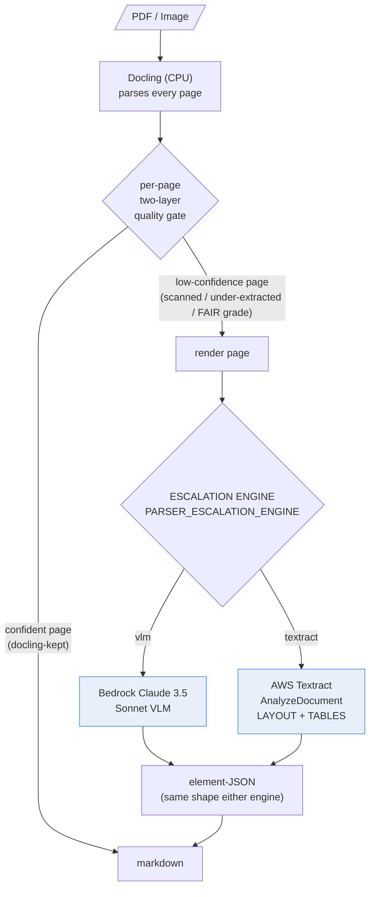

# Escalation Engine Comparison: Bedrock Claude Sonnet VLM vs AWS Textract

**Date:** 2026-06-15 · **Status:** Findings + recommendation. The default escalation engine
remains `vlm`; no production change has been made.

> **This run uses the updated doc-bench wheel's bundled stratified fixtures: 5 dp_bench /
> 5 omnidocbench / 1 ato_bench (11 docs total).** It supersedes an earlier draft that ran on
> the repo's larger `references/` samples (12 dp / 10 omni); numbers and per-doc detail below
> are **not** comparable to that draft.

---

## Executive summary

doc-parser parses every page with Docling first, then **escalates only the pages a
quality gate flags as low-confidence** (scanned, degraded, or under-extracted) to a
second engine. Today that engine is the Bedrock Claude 3.5 Sonnet VLM. We added AWS
Textract (`AnalyzeDocument`, synchronous, `LAYOUT + TABLES`) as a drop-in alternative
behind a config switch (`PARSER_ESCALATION_ENGINE=vlm|textract`) and benchmarked both
head-to-head on the same pages.

**Key findings:**

1. **Escalation rarely fires on this set — so on most docs the engines are identical.**
   Only **1 of 5** dp_bench docs and **0 of 5** omnidocbench docs escalated; the ATO form
   escalated fully (2/2 pages). `docling-kept` pages are byte-identical between engines, so
   the engine choice only changed **2 documents** in the whole run (ATO + dp `…027`).

2. **Where escalation does fire, Textract wins on scanned/degraded input.**
   - **ATO form (our target workload): Textract wins decisively** — NED **0.280 vs 0.149**
     (**+88%**); Docling-only baseline 0.119.
   - **dp_bench `…027` (a bad scan, the one promoted doc): Textract rescues it** — NED
     **0.887 vs 0.360**. This single doc lifts the dp_bench average to **0.965 vs 0.859**.
   - **OmniDocBench: no signal.** 0/5 pages escalated, so vlm and textract are **identical**
     (NED 0.697, TEDS 0.262). This set gives us **no** VLM-vs-Textract evidence on complex
     layouts (the earlier larger-sample draft hinted the VLM could edge Textract on a promoted
     complex page, but that page isn't in this set — treat as unverified here).

3. **Textract escalation is much faster than the VLM, per escalated page.** Textract adds
   **~6 s** (ATO) to **~8 s** (dp `…027`); the VLM adds **~37 s** (ATO) to **~14 s** (dp `…027`)
   — roughly **2–6× slower**, and far more variable.

4. **Docling on CPU is the dominant latency cost — not the escalation engine.** On this
   CPU-only host Docling takes ~5–16 s/page for clean digital PDFs but **~60–115 s/page for
   scanned/complex pages**. It dwarfs the escalation step on every hard doc and is the single
   biggest lever on end-to-end latency (argues for GPU or right-sized CPU, independent of
   engine choice).

5. **Textract is not cheaper per call.** Bedrock VLM ≈ **$0.0126/page**; Textract
   `LAYOUT+TABLES` ≈ **$0.019/page** (AWS list price; see caveat). Textract's advantage is
   **speed and scan quality**, not API price. Cost applies only to the minority of escalated pages.

6. **Important caveat for forms:** the Textract engine intentionally uses `LAYOUT + TABLES`,
   **not `FORMS`**. ATO forms are dominated by key-value form fields, which `LAYOUT` returns as
   flat text. Enabling `FORMS` is the most promising untested lever for ATO-form quality (§6).

**Recommendation:** For our ATO-centric, scan-heavy workload, **Textract is the better default
escalation engine** — higher quality on forms/scans and lower escalation latency, and on this
run VLM escalation actually *hurt* dp_bench (0.859 < the 0.899 Docling baseline) while Textract
helped (0.965). Caveat: escalation fired on only 2 docs here, so the evidence base is narrow.
Before flipping the default we should (a) validate at larger scale and (b) prototype a
`FORMS`-enabled variant for forms (§6, §8).

---

## 1. Background — how escalation works

- **Only escalated pages differ between engines.** `docling-kept` pages are byte-identical
  regardless of engine, so all quality/latency *differences* below come from the promoted pages.
- The escalation engine returns the **same element-JSON shape** either way, so the downstream
  markdown renderer and grading are unchanged — making this a clean apples-to-apples comparison.
- Textract is called **synchronously** on the already-rendered page image
  (`AnalyzeDocument(Document={"Bytes": ...}, FeatureTypes=["LAYOUT","TABLES"])`) — **no S3, no
  async polling.**

**Promotion rates in this run** (fraction that escalated):

| dataset | promoted | notes |
|---|---|---|
| ato_bench | **2 / 2 pages** (1/1 doc) | whole form is a low-grade scan |
| dp_bench | **1 / 5 docs** (`…027`) | clean digital PDFs; Docling keeps the other 4 |
| omnidocbench | **0 / 5 docs** | nothing escalated → engines identical on this set |

---

## 2. Test environment & methodology

| Item | Value |
|---|---|
| Compute | AWS instance, **8 vCPU Intel Xeon E5-2686 v4 @ 2.30 GHz**, **CPU-only (no GPU)** |
| Docling accelerator | `cpu` (confirmed in logs); ~1.6 GB RAM/worker |
| Batch concurrency | **4** (`PARSER_CONCURRENCY=4`, parse_batch default) |
| Region | `ap-southeast-2` (Textract + Bedrock; required — other regions denied by org SCP) |
| VLM | Bedrock `anthropic.claude-3-5-sonnet-20241022-v2:0`, `temperature=0`, page-image input |
| Textract | `AnalyzeDocument`, sync, `FeatureTypes=["LAYOUT","TABLES"]` |
| Grader | doc-bench wheel with **NED + TEDS** metrics (NID/BLEU/METEOR retired) |
| Datasets | **bundled stratified fixtures from the wheel**: ato_bench (1 doc / 2 pp), dp_bench (5 docs), OmniDocBench (5 docs) |

**Metrics** (both higher = better):
- **NED** — normalized edit-distance similarity of extracted text vs gold (replaces the old NID).
- **TEDS** — table-structure similarity; 0 when a document has no scored table in the gold.

**Method.** The wheel's bundled stratified fixtures were staged into grader `--data-dir`
layouts (`scripts/stage_wheel_fixtures.py`: `reference.json`+`pdfs/` for dp_bench,
`OmniDocBench.json`+`images/` for omnidocbench; ATO grades against the bundled manifest gold).
Each dataset was parsed twice — once per engine, changing only `PARSER_ESCALATION_ENGINE` —
then graded with the same wheel. The escalation engine is the **only** variable; Docling and the
gate are held constant. Latency was taken from per-document `parse_duration_s` logs; the Docling
portion from Docling's own "Finished converting … in N sec" log line; escalation overhead = total
− Docling-convert (covers page render + the engine call + mapping + markdown render, of which the
engine call dominates).

**Methodology caveats** (read before quoting latency):
- Per-document latencies were measured at **concurrency = 4** on 8 cores, so Docling times
  include CPU contention; **isolated single-document times would be lower.** The ATO run was a
  single document (effectively isolated) — treat it as the cleanest per-doc datapoint.
- `docling-kept` docs *should* have identical vlm/textract latency (same work); small
  differences in the per-doc tables below (e.g. dp `…001`: 11.1 s vs 13.9 s) are run-to-run
  contention noise, not engine effects.
- These are **small stratified samples** (1 / 5 / 5 docs) and only **2 docs escalated** — see §7.
- TEDS = 0 on ato_bench and dp_bench reflects the gold (no scored table structure), not a failure.

---

## 3. Quality results (NED + TEDS)

### Aggregate per dataset

| dataset | engine | NED | TEDS | Docling-only baseline (NED) | winner |
|---|---|--:|--:|--:|:--:|
| **ato_bench** (1) | vlm | 0.1487 | 0.0000 | 0.1193 | |
| | **textract** | **0.2800** | 0.0000 | | ✅ Textract (+88% NED) |
| **dp_bench** (5) | vlm | 0.8594 | 0.0000 | 0.8993 | |
| | **textract** | **0.9647** | 0.0000 | | ✅ Textract |
| **omnidocbench** (5) | vlm | 0.6974 | 0.2621 | 0.7688 | — identical |
| | textract | 0.6974 | 0.2621 | | (0 escalated) |

Notes:
- **VLM escalation *underperformed* the Docling-only baseline on dp_bench** (0.859 < 0.899):
  the VLM's output for the one promoted scan (`…027`, NED 0.36) was worse than Docling's own
  text would have been. Textract's rescue (0.887) pushed the average above baseline (0.965).
- OmniDocBench shows both engines at 0.697 — **below** the bundled 0.769 baseline — but with
  **0 escalations** both engines equal pure Docling here, so this gap reflects a
  baseline/pipeline-provenance difference (the bundled baseline also reports TEDS 0 where we
  measure 0.262), **not** an engine effect. Do not read it as a regression from engine choice.

### Per-promoted-doc detail (the only docs where engines differ)

| doc | NED vlm → tex | TEDS vlm → tex | read |
|---|---|---|---|
| ato · 1371-6.1997 | 0.149 → **0.280** | 0 → 0 | Textract much better on the scanned form |
| dp · …027 | 0.360 → **0.887** | 0 → 0 | Textract rescues a bad scan the VLM mangled |

All other docs (4× dp_bench, 5× omnidocbench) were `docling-kept` → **byte-identical NED/TEDS**
between engines.

---

## 4. Latency analysis

### 4.1 Docling on CPU — the dominant cost

Docling runs on **every** page and is the largest latency component on this CPU-only host.
Measured Docling-convert time per document (concurrency 4 unless noted):

| document class | Docling convert | example |
|---|---|---|
| Clean digital PDF (dp_bench, docling-kept) | **~5–16 s** | `…001` 4.8 s, `…017` 11.9 s |
| Harder digital PDF (dp_bench, promoted) | ~27–33 s | `…027` = 33 s (vlm) / 27 s (tex) |
| Scanned / complex image (omnidocbench) | **~58–115 s** (mean ~92 s) | dense pages ~93–115 s |
| Scanned multi-page form (ato, **isolated**) | **~133 s for 2 pp (~66 s/page)** | 1371-6.1997 |

**Takeaway:** for scanned/complex documents, Docling on CPU is 60–115 s **per page** and
overwhelmingly dominates end-to-end time. GPU acceleration or right-sized CPU is the single
biggest latency lever — and it is **independent of which escalation engine is chosen.**

### 4.2 Escalation overhead — Textract vs VLM (the part we control)

Added time **per escalated page** (total − Docling-convert) on the two docs that escalated:

| promoted doc | VLM overhead | Textract overhead | Textract speedup |
|---|--:|--:|--:|
| ato_bench (2 pp) | **36.6 s/page** | **5.7 s/page** | ~6.4× |
| dp_bench `…027` (1 pp) | **13.6 s** | **8.1 s** | ~1.7× |

**Textract escalation is markedly faster and tighter** — single-digit seconds per page vs the
VLM's tens of seconds, with much lower variance.

### 4.3 End-to-end per-document latency (measured)

| document | VLM total | Textract total | Δ |
|---|--:|--:|--:|
| ATO form (2 pp, scanned, isolated) | **205.7 s** | **145.3 s** | −60 s (−29%) |
| dp · …027 (1 pp, promoted) | 46.7 s | 35.4 s | −11 s (−24%) |
| any `docling-kept` doc | identical (± contention noise) | | ~0 |

Even where Textract is ~6× faster *at the escalation step*, the document total moves less
because Docling-convert dominates (ATO: 133 s of the total is Docling, unchanged by engine).

### 4.4 Batch throughput & concurrency

At concurrency 4, the **dp_bench batch (5 docs) completed in ~47 s wall-clock (vlm) / ~36 s
(textract)** — concurrency hides much of the per-doc latency at the cost of CPU contention and
~1.6 GB RAM/worker. For capacity planning, **Docling CPU time is the binding constraint**; the
escalation engine mainly affects tail latency on the few promoted pages (where Textract is tighter).

---

## 5. Cost

| engine | per-page API cost | basis |
|---|--:|---|
| Bedrock Claude 3.5 Sonnet VLM | **~$0.0126 / page** | parse_batch's logged cost model (≈$0.0126/VLM call) |
| Textract `LAYOUT + TABLES` | **~$0.019 / page** | AWS list price (Layout $0.004 + Tables $0.015), tier-1 |

- **Textract costs ~1.5× the VLM per page on API price** — it is *not* the cheaper option per
  call. Its wins are latency and scan quality.
- Cost applies **only to escalated pages** (here just 3 pages across the whole run), so absolute
  spend is tiny in both cases.
- **Caveat:** the Textract figure is AWS list price and must be confirmed for **ap-southeast-2**
  (Sydney pricing can differ from us-east-1). parse_batch currently reports Textract cost as $0
  because its cost model only knows Bedrock — this needs adding before cost dashboards are trusted.

---

## 6. Important caveat — `FORMS` is not enabled (matters for ATO)

The Textract engine uses `FeatureTypes=["LAYOUT","TABLES"]` by design. Verified on the ATO form
(`1371-6.1997.pdf`, page 1), Textract's `LAYOUT` returned **23 elements — 16 paragraphs, 2
headings, 2 lists, 2 footers, 1 figure, and 0 tables.** The form's information actually lives in
**key-value form fields**, which a separate exploratory `AnalyzeDocument` with `FORMS` extracted
as **91 key-value pairs** (vs only 1 tiny table). So:

- Requesting `TABLES` contributes little on ATO forms — they aren't tabular.
- The form's structured field data (`label → value`) is **not captured as structure** today; it
  only survives as flat `LAYOUT` text. This is the most likely reason ATO NED stays low (0.28)
  even though Textract beats the VLM.
- **`FORMS` is the untested lever** most likely to materially lift ATO-form extraction.

This does not change the head-to-head conclusion (Textract still beats the VLM on ATO text), but
it means **neither current engine extracts ATO form structure** — a gap worth closing.

---

## 7. Limitations

- **Tiny escalation base.** Only **2 of 11 docs escalated** (ATO + dp `…027`). Every
  engine-difference conclusion rests on those two documents; the other 9 were `docling-kept`
  and identical. This is directional, not a large-N result.
- **No OmniDocBench signal.** 0/5 omnidocbench pages escalated, so this run says **nothing**
  about VLM-vs-Textract on complex layouts. Any such claim needs a set that actually promotes
  those pages.
- **One ATO document.** The ATO conclusion rests on a single (representative) form.
- **Latency measured at concurrency 4 on CPU** — contention inflates per-doc Docling times;
  isolated numbers would be lower. Only the ATO doc was effectively isolated.
- **Baseline provenance differs.** The bundled `*_results.json` baselines disagree with our
  pure-Docling output where nothing escalated (omni 0.769 vs 0.697; TEDS 0 vs 0.262), so treat
  baseline deltas as rough context, not exact apples-to-apples.
- **METEOR/BLEU/NID** from the older wheel are deprecated and excluded; do not compare to prior
  reports that quoted NID.

---

## 8. Recommendations

1. **Adopt Textract as the default escalation engine for scan-heavy / ATO workloads**, pending
   the scale check below. On this run it was higher-quality on the ATO form and the one promoted
   scan, faster per escalated page, and — unlike the VLM — it did not drag dp_bench below the
   Docling baseline.
2. **Validate at scale on a set that actually escalates.** With only 2/11 docs promoted here,
   the next run needs more scanned/degraded docs (a larger ATO corpus, the full DP-Bench) so the
   engine comparison fires on enough pages to be conclusive — especially for complex layouts,
   where this set gave no signal.
3. **Prototype a `FORMS`-enabled Textract variant** (`LAYOUT+TABLES+FORMS`) and re-benchmark
   ATO-bench — the highest-upside experiment for our actual workload (§6).
4. **Invest in Docling throughput (GPU or right-sized CPU)** — it dominates latency regardless of
   engine. Engine choice optimizes the escalation tail; Docling optimizes the whole.
5. **Fix cost telemetry:** add a Textract price model to parse_batch so cost dashboards reflect
   Textract runs (currently logged as $0).
6. **Keep both engines** behind the `PARSER_ESCALATION_ENGINE` switch — a per-workload or
   per-page engine policy may ultimately beat picking one globally, but we lack the data to
   prefer the VLM anywhere on this set.

---

## Appendix — reproducibility

- Stage the wheel's bundled 5/5/1 fixtures into grader `--data-dir`s:
  `uv run python scripts/stage_wheel_fixtures.py ./doc_bench-0.1.0-py3-none-any.whl eval_runs/bench2`
- Run all three datasets, both engines: `scripts/run_benchmark2.sh`
  (parse with `PARSER_ESCALATION_ENGINE`, grade with the wheel; ATO grades against the bundled
  manifest gold, dp/omni via `--data-dir`).
- Aggregate per-file NED/TEDS + route + latency: `scripts/aggregate_benchmark.py eval_runs/bench2`
  → `eval_runs/bench2/benchmark_report.md`.
- Grader: install the updated wheel via
  `uv tool install --force ./doc_bench-0.1.0-py3-none-any.whl` (+ into `.venv-docbench`).
- All latency numbers derive from the `file_parsed` JSON log lines and Docling's
  "Finished converting … in N sec" lines under `eval_runs/bench2/<dataset>/parse_<engine>.log`.

### Raw aggregate table

| dataset | engine | NED | TEDS | mean doc latency (conc=4) | promoted |
|---|---|--:|--:|--:|--:|
| ato_bench | vlm | 0.1487 | 0.0000 | 205.7 s | 1/1 doc (2/2 pp) |
| ato_bench | textract | 0.2800 | 0.0000 | 145.3 s | 1/1 doc (2/2 pp) |
| dp_bench | vlm | 0.8594 | 0.0000 | 19.9 s | 1/5 docs |
| dp_bench | textract | 0.9647 | 0.0000 | 19.1 s | 1/5 docs |
| omnidocbench | vlm | 0.6974 | 0.2621 | 91.9 s | 0/5 docs |
| omnidocbench | textract | 0.6974 | 0.2621 | 90.5 s | 0/5 docs |
