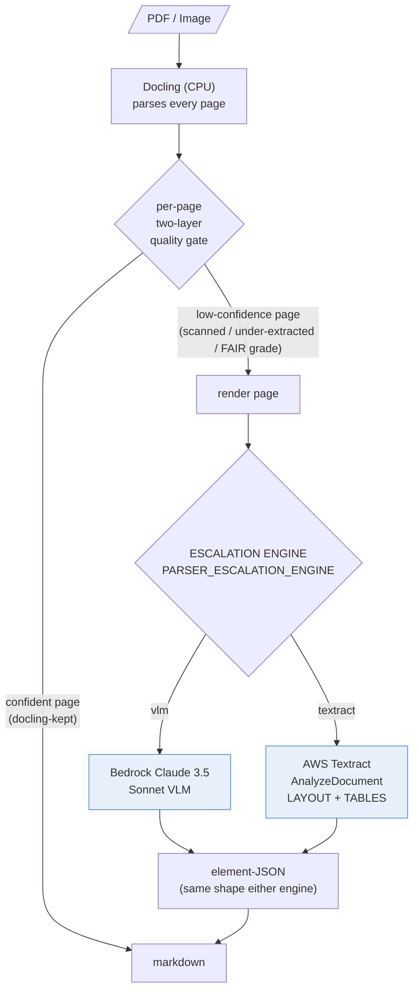

# Escalation Engine Comparison: Bedrock Claude Sonnet VLM vs AWS Textract

> ⚠️ **SUPERSEDED (2026-06-30) — historical record.** The VLM figures below were measured on
> **Sonnet 3.5** (`claude-3-5-sonnet-20241022-v2:0`), now retired. The Sonnet **4.6** re-benchmark
> at `eval_runs/model_compare/model_compare_report.md` is the current source of truth: it
> **inverts** this doc's scan conclusion — VLM 4.6 now *beats* Textract on the ATO scan (0.648 vs
> 0.322, vs 3.5's 0.149), while Textract still wins dp_bench…027 (0.887 vs 0.287). This doc is
> preserved as the dated record that motivated the re-benchmark; do not treat its Sonnet-3.5
> numbers as current. See `agent-os/product/engine-hardening-plan.md` §2.2.

**Date:** 2026-06-16 · **Status:** Findings + recommendation (Sonnet 3.5). The default escalation
engine remains `vlm`; no production change has been made.

> **Primary run uses the updated doc-bench wheel's bundled stratified fixtures: 5 dp_bench /
> 5 omnidocbench / 1 ato_bench (11 docs total)** (§1–§6). Because that set escalated almost
> nothing, **§7 adds a 20-page OmniDocBench probe** that actually fires the gate (2/20) and
> drives the escalated-page investigation. Both supersede an earlier draft on the repo's
> larger `references/` samples (12 dp / 10 omni); numbers there are **not** comparable.

---

## Executive summary

doc-parser parses every page with Docling first, then **escalates only the pages a
quality gate flags as low-confidence** (scanned, degraded, or under-extracted) to a
second engine. Today that engine is the Bedrock Claude 3.5 Sonnet VLM. We added AWS
Textract (`AnalyzeDocument`, synchronous, `LAYOUT + TABLES`) as a drop-in alternative
behind a config switch (`PARSER_ESCALATION_ENGINE=vlm|textract`) and benchmarked both
head-to-head on the same pages.

**Key findings:**

1. **Escalation rarely fires on this set — so on most docs the engines are identical.**
   Only **1 of 5** dp_bench docs and **0 of 5** omnidocbench docs escalated; the ATO form
   escalated fully (2/2 pages). `docling-kept` pages are byte-identical between engines, so
   the engine choice only changed **2 documents** in the whole run (ATO + dp `…027`).

2. **Where escalation does fire, Textract wins on scanned/degraded input.**
   - **ATO form (our target workload): Textract wins decisively** — NED **0.280 vs 0.149**
     (**+88%**); Docling-only baseline 0.119.
   - **dp_bench `…027` (a bad scan, the one promoted doc): Textract rescues it** — NED
     **0.887 vs 0.360**. This single doc lifts the dp_bench average to **0.965 vs 0.859**.
   - **OmniDocBench (stratified 5): no signal** — 0/5 pages escalated, so vlm and textract are
     **identical** (NED 0.697). For an actual signal, **§7's 20-page OmniDocBench probe** escalates
     2/20: Textract wins one (PPT) decisively and "loses" the other (academic) — but that loss is
     a **metric artifact**, see below.

7. **On a complex page, NED understates Textract (the metric, not the engine).** On the one
   academic page where Textract "lost" (NED 0.360 vs 0.591), Textract actually extracted **96%
   of the gold's words** vs the VLM's 63% — the VLM silently dropped ~37% of the text. Textract
   scored lower only because its multi-column **reading order** differs from the gold (edit
   distance punishes transpositions; order-independent NED is **0.948 vs 0.618** in Textract's
   favour). The VLM's failure modes — **hallucinated image captions** and **silent content loss**
   — are worse for an extraction product than a fixable ordering quirk (§7).

3. **Textract escalation is much faster than the VLM, per escalated page.** Textract adds
   **~6 s** (ATO) to **~8 s** (dp `…027`); the VLM adds **~37 s** (ATO) to **~14 s** (dp `…027`)
   — roughly **2–6× slower**, and far more variable.

4. **Docling on CPU is the dominant latency cost — not the escalation engine.** On this
   CPU-only host Docling takes ~5–16 s/page for clean digital PDFs but **~60–115 s/page for
   scanned/complex pages**. It dwarfs the escalation step on every hard doc and is the single
   biggest lever on end-to-end latency (argues for GPU or right-sized CPU, independent of
   engine choice).

5. **Textract is not cheaper per call.** Bedrock VLM ≈ **$0.0126/page**; Textract
   `LAYOUT+TABLES` ≈ **$0.019/page** (AWS list price; see caveat). Textract's advantage is
   **speed and scan quality**, not API price. Cost applies only to the minority of escalated pages.

6. **Important caveat for forms:** the Textract engine intentionally uses `LAYOUT + TABLES`,
   **not `FORMS`**. ATO forms are dominated by key-value form fields, which `LAYOUT` returns as
   flat text. Enabling `FORMS` is the most promising untested lever for ATO-form quality (§6).

**Recommendation:** For our ATO-centric, scan-heavy workload, **Textract is the better default
escalation engine** — higher quality on forms/scans and lower escalation latency, and on this
run VLM escalation actually *hurt* dp_bench (0.859 < the 0.899 Docling baseline) while Textract
helped (0.965). Caveat: escalation fired on only 2 docs here, so the evidence base is narrow.
Before flipping the default we should (a) validate at larger scale and (b) prototype a
`FORMS`-enabled variant for forms (§6, §9).

---

## 1. Background — how escalation works



- **Only escalated pages differ between engines.** `docling-kept` pages are byte-identical
  regardless of engine, so all quality/latency *differences* below come from the promoted pages.
- The escalation engine returns the **same element-JSON shape** either way, so the downstream
  markdown renderer and grading are unchanged — making this a clean apples-to-apples comparison.
- Textract is called **synchronously** on the already-rendered page image
  (`AnalyzeDocument(Document={"Bytes": ...}, FeatureTypes=["LAYOUT","TABLES"])`) — **no S3, no
  async polling.**

**Promotion rates in this run** (fraction that escalated):

| dataset | promoted | notes |
|---|---|---|
| ato_bench | **2 / 2 pages** (1/1 doc) | whole form is a low-grade scan |
| dp_bench | **1 / 5 docs** (`…027`) | clean digital PDFs; Docling keeps the other 4 |
| omnidocbench | **0 / 5 docs** | nothing escalated → engines identical on this set |

---

## 2. Test environment & methodology

| Item | Value |
|---|---|
| Compute | AWS instance, **8 vCPU Intel Xeon E5-2686 v4 @ 2.30 GHz**, **CPU-only (no GPU)** |
| Docling accelerator | `cpu` (confirmed in logs); ~1.6 GB RAM/worker |
| Batch concurrency | **4** (`PARSER_CONCURRENCY=4`, parse_batch default) |
| Region | `ap-southeast-2` (Textract + Bedrock; required — other regions denied by org SCP) |
| VLM | Bedrock `anthropic.claude-3-5-sonnet-20241022-v2:0`, `temperature=0`, page-image input — **an older model; see the model caveat in §8** |
| Textract | `AnalyzeDocument`, sync, `FeatureTypes=["LAYOUT","TABLES"]` |
| Grader | doc-bench wheel with **NED + TEDS** metrics (NID/BLEU/METEOR retired) |
| Datasets | **bundled stratified fixtures from the wheel**: ato_bench (1 doc / 2 pp), dp_bench (5 docs), OmniDocBench (5 docs) |

**Metrics** (both higher = better):
- **NED** — normalized edit-distance similarity of extracted text vs gold (replaces the old NID).
- **TEDS** — table-structure similarity; 0 when a document has no scored table in the gold.

**Method.** The parser reads the wheel's bundled source files directly (the installed wheel
ships exactly the manifest's 5/5/1 docs) and the grader scores them against the wheel's bundled
gold — no `--data-dir`, no staging. Each dataset was parsed twice — once per engine, changing
only `PARSER_ESCALATION_ENGINE` —
then graded with the same wheel. The escalation engine is the **only** variable; Docling and the
gate are held constant. Latency was taken from per-document `parse_duration_s` logs; the Docling
portion from Docling's own "Finished converting … in N sec" log line; escalation overhead = total
− Docling-convert (covers page render + the engine call + mapping + markdown render, of which the
engine call dominates).

**Methodology caveats** (read before quoting latency):
- Per-document latencies were measured at **concurrency = 4** on 8 cores, so Docling times
  include CPU contention; **isolated single-document times would be lower.** The ATO run was a
  single document (effectively isolated) — treat it as the cleanest per-doc datapoint.
- `docling-kept` docs *should* have identical vlm/textract latency (same work); small
  differences in the per-doc tables below (e.g. dp `…001`: 11.1 s vs 13.9 s) are run-to-run
  contention noise, not engine effects.
- These are **small stratified samples** (1 / 5 / 5 docs) and only **2 docs escalated** — see §7.
- TEDS = 0 on ato_bench and dp_bench reflects the gold (no scored table structure), not a failure.

---

## 3. Quality results (NED + TEDS)

### Aggregate per dataset

| dataset | engine | NED | TEDS | Docling-only baseline (NED) | winner |
|---|---|--:|--:|--:|:--:|
| **ato_bench** (1) | vlm | 0.1487 | 0.0000 | 0.1193 | |
| | **textract** | **0.2800** | 0.0000 | | ✅ Textract (+88% NED) |
| **dp_bench** (5) | vlm | 0.8594 | 0.0000 | 0.8993 | |
| | **textract** | **0.9647** | 0.0000 | | ✅ Textract |
| **omnidocbench** (5) | vlm | 0.6974 | 0.2621 | 0.7688 | — identical |
| | textract | 0.6974 | 0.2621 | | (0 escalated) |

Notes:
- **VLM escalation *underperformed* the Docling-only baseline on dp_bench** (0.859 < 0.899):
  the VLM's output for the one promoted scan (`…027`, NED 0.36) was worse than Docling's own
  text would have been. Textract's rescue (0.887) pushed the average above baseline (0.965).
- OmniDocBench shows both engines at 0.697 — **below** the bundled 0.769 baseline — but with
  **0 escalations** both engines equal pure Docling here, so this gap reflects a
  baseline/pipeline-provenance difference (the bundled baseline also reports TEDS 0 where we
  measure 0.262), **not** an engine effect. Do not read it as a regression from engine choice.

### Per-promoted-doc detail (the only docs where engines differ)

| doc | NED vlm → tex | TEDS vlm → tex | read |
|---|---|---|---|
| ato · 1371-6.1997 | 0.149 → **0.280** | 0 → 0 | Textract much better on the scanned form |
| dp · …027 | 0.360 → **0.887** | 0 → 0 | Textract rescues a bad scan the VLM mangled |

All other docs (4× dp_bench, 5× omnidocbench) were `docling-kept` → **byte-identical NED/TEDS**
between engines.

---

## 4. Latency analysis

### 4.1 Docling on CPU — the dominant cost

Docling runs on **every** page and is the largest latency component on this CPU-only host.
Measured Docling-convert time per document (concurrency 4 unless noted):

| document class | Docling convert | example |
|---|---|---|
| Clean digital PDF (dp_bench, docling-kept) | **~5–16 s** | `…001` 4.8 s, `…017` 11.9 s |
| Harder digital PDF (dp_bench, promoted) | ~27–33 s | `…027` = 33 s (vlm) / 27 s (tex) |
| Scanned / complex image (omnidocbench) | **~58–115 s** (mean ~92 s) | dense pages ~93–115 s |
| Scanned multi-page form (ato, **isolated**) | **~133 s for 2 pp (~66 s/page)** | 1371-6.1997 |

**Takeaway:** for scanned/complex documents, Docling on CPU is 60–115 s **per page** and
overwhelmingly dominates end-to-end time. GPU acceleration or right-sized CPU is the single
biggest latency lever — and it is **independent of which escalation engine is chosen.**

### 4.2 Escalation overhead — Textract vs VLM (the part we control)

Added time **per escalated page** (total − Docling-convert) on the two docs that escalated:

| promoted doc | VLM overhead | Textract overhead | Textract speedup |
|---|--:|--:|--:|
| ato_bench (2 pp) | **36.6 s/page** | **5.7 s/page** | ~6.4× |
| dp_bench `…027` (1 pp) | **13.6 s** | **8.1 s** | ~1.7× |

**Textract escalation is markedly faster and tighter** — single-digit seconds per page vs the
VLM's tens of seconds, with much lower variance.

### 4.3 End-to-end per-document latency (measured)

| document | VLM total | Textract total | Δ |
|---|--:|--:|--:|
| ATO form (2 pp, scanned, isolated) | **205.7 s** | **145.3 s** | −60 s (−29%) |
| dp · …027 (1 pp, promoted) | 46.7 s | 35.4 s | −11 s (−24%) |
| any `docling-kept` doc | identical (± contention noise) | | ~0 |

Even where Textract is ~6× faster *at the escalation step*, the document total moves less
because Docling-convert dominates (ATO: 133 s of the total is Docling, unchanged by engine).

### 4.4 Batch throughput & concurrency

At concurrency 4, the **dp_bench batch (5 docs) completed in ~47 s wall-clock (vlm) / ~36 s
(textract)** — concurrency hides much of the per-doc latency at the cost of CPU contention and
~1.6 GB RAM/worker. For capacity planning, **Docling CPU time is the binding constraint**; the
escalation engine mainly affects tail latency on the few promoted pages (where Textract is tighter).

---

## 5. Cost

| engine | per-page API cost | basis |
|---|--:|---|
| Bedrock Claude 3.5 Sonnet VLM | **~$0.0126 / page** | parse_batch's logged cost model (≈$0.0126/VLM call) |
| Textract `LAYOUT + TABLES` | **~$0.019 / page** | AWS list price (Layout $0.004 + Tables $0.015), tier-1 |

- **Textract costs ~1.5× the VLM per page on API price** — it is *not* the cheaper option per
  call. Its wins are latency and scan quality.
- Cost applies **only to escalated pages** (here just 3 pages across the whole run), so absolute
  spend is tiny in both cases.
- **Caveat:** the Textract figure is AWS list price and must be confirmed for **ap-southeast-2**
  (Sydney pricing can differ from us-east-1). parse_batch currently reports Textract cost as $0
  because its cost model only knows Bedrock — this needs adding before cost dashboards are trusted.

---

## 6. Important caveat — `FORMS` is not enabled (matters for ATO)

The Textract engine uses `FeatureTypes=["LAYOUT","TABLES"]` by design. Verified on the ATO form
(`1371-6.1997.pdf`, page 1), Textract's `LAYOUT` returned **23 elements — 16 paragraphs, 2
headings, 2 lists, 2 footers, 1 figure, and 0 tables.** The form's information actually lives in
**key-value form fields**, which a separate exploratory `AnalyzeDocument` with `FORMS` extracted
as **91 key-value pairs** (vs only 1 tiny table). So:

- Requesting `TABLES` contributes little on ATO forms — they aren't tabular.
- The form's structured field data (`label → value`) is **not captured as structure** today; it
  only survives as flat `LAYOUT` text. This is the most likely reason ATO NED stays low (0.28)
  even though Textract beats the VLM.
- **`FORMS` is the untested lever** most likely to materially lift ATO-form extraction.

This does not change the head-to-head conclusion (Textract still beats the VLM on ATO text), but
it means **neither current engine extracts ATO form structure** — a gap worth closing.

---

## 7. OmniDocBench 20-page probe — escalation fires; metric vs. capability

The stratified set above escalated **0/5** OmniDocBench pages, giving no engine signal. To
exercise the gate, we drew **20 random English pages** (seed `20260616`) from the full 593-page
OmniDocBench (mix: 6 book, 5 academic, 5 PPT, 3 exam, 1 textbook) and ran both engines.

| engine | NED | TEDS | mean lat (s) | escalated |
|---|--:|--:|--:|--:|
| vlm | 0.6990 | 0.0890 | 107.3 | **2 / 20** |
| textract | **0.7272** | 0.0890 | 106.6 | **2 / 20** |

**18 of 20 pages were `docling-kept`** → byte-identical between engines; the whole difference
rides on 2 escalated pages (same pages under both engines — the gate runs on Docling output,
before the engine is chosen). Latency stays Docling-CPU-bound (~107 s/page; academic pages hit
180–217 s); both escalated pages were *faster* under Textract.

| escalated page | data_source | gate reason | NED vlm → tex |
|---|---|---|---|
| `…Where_did_you_go.pdf_5` | PPT2PDF | `docling_low_grade=FAIR` | 0.156 → **0.952** |
| `scihub_md.…2934.pdf_0` | academic_literature | `heuristic_failed: repeated_char_run` | **0.591** → 0.360 |

### 7.1 PPT slide — VLM hallucination vs Textract OCR (Textract wins)

Gold is two short strings: `Where did Amy go on vacation?` / `London Eye`. The **VLM invented a
description of the slide's images** ("Two images showing the London Eye observation wheel on the
River Thames … one on a cloudy day …"), collapsing NED to 0.156. Textract OCR'd only the on-page
text and matched gold almost exactly (0.952). This is a clean **VLM failure mode** — verbose
image captioning on a sparse, image-heavy slide — and exactly the page Textract handles better.

### 7.2 Academic page — the metric is misleading (Textract extracts more, scores lower)

Both engines produced fluent text on this dense two-column journal page, but the scores invert
the truth (measured with the grader's own `ned_score`/`_normalize`):

| measure | VLM | Textract | reading |
|---|--:|--:|---|
| Normalized length vs gold (6,284) | 3,944 (63%) | **6,240 (99%)** | VLM dropped ~37%; Textract is complete |
| **Word containment** (% of gold's distinct words) | 63% | **96%** | Textract captured nearly all gold vocabulary |
| **Order-independent NED** (words sorted) | 0.618 | **0.948** | on *content alone*, Textract is far closer |
| **Sequential NED** (grader's score) | **0.591** | 0.360 | flips — penalizes Textract |

**Diagnosis: reading order, not capability.** Sequential edit distance punishes
**transpositions** — Textract's `LAYOUT` emitted the two columns in an order that differs from
the gold's reading order, so large, correctly-extracted chunks count as "moved". The VLM reflows
into gold order but **silently omits ~37%** of the text; the metric rewards the ordered fragment
and is blind to the omission. Confirmed it is *not* formatting: de-hyphenating Textract's line
breaks leaves NED unchanged (0.360 → 0.360), since the grader already collapses whitespace.

**Implication.** Textract is the stronger *extractor* on both escalated pages (no hallucination,
96% vs 63% content recall); its only "loss" is a mechanically fixable ordering quirk. The
highest-upside Textract lever here is **reading-order reconciliation** — sorting `LAYOUT` blocks
into column-aware reading order before markdown assembly would lift the academic page from ~0.36
toward the ~0.95 its content warrants. (Probe was a one-off; raw outputs were not retained —
see the appendix to regenerate.)

---

## 8. Limitations

- **Tiny escalation base.** Only **2 of 11 docs** escalated in the stratified run and **2 of 20**
  in the §7 probe — **4 escalated pages total** across everything. Every engine-difference
  conclusion rests on those pages; the rest were `docling-kept` and identical. Directional, not
  large-N.
- **NED understates Textract on multi-column pages.** Sequential edit distance penalizes
  reading-order transpositions (§7.2), so a complete-but-reordered Textract extraction can score
  *below* an incomplete-but-ordered VLM one. Treat NED as a lower bound for Textract on complex
  layouts until reading-order reconciliation lands; report content-recall alongside it.
- **VLM tested on an older model — results are a floor for the VLM.** All VLM numbers use
  **Claude 3.5 Sonnet** (`claude-3-5-sonnet-20241022-v2:0`), which is materially weaker than the
  current **Claude Sonnet 4.6**. The VLM's observed failure modes (hallucinated image captions in
  §7.1, ~37% content omission in §7.2) are exactly the kind a stronger model tends to reduce, so
  the VLM side likely **improves with Sonnet 4.6** — re-run the head-to-head on the newer model
  before treating any VLM-vs-Textract quality gap as settled.
- **One ATO document.** The ATO conclusion rests on a single (representative) form.
- **Latency measured at concurrency 4 on CPU** — contention inflates per-doc Docling times;
  isolated numbers would be lower. Only the ATO doc was effectively isolated.
- **Baseline provenance differs.** The bundled `*_results.json` baselines disagree with our
  pure-Docling output where nothing escalated (omni 0.769 vs 0.697; TEDS 0 vs 0.262), so treat
  baseline deltas as rough context, not exact apples-to-apples.
- **METEOR/BLEU/NID** from the older wheel are deprecated and excluded; do not compare to prior
  reports that quoted NID.

---

## 9. Recommendations

1. **Adopt Textract as the default escalation engine for scan-heavy / ATO workloads**, pending
   the scale check below. Across all escalated pages it was higher-quality (ATO form, the dp
   `…027` scan, the PPT slide), faster per escalated page, and the stronger *extractor* on the
   academic page too (96% vs 63% content recall) — and unlike the VLM it did not drag dp_bench
   below the Docling baseline, hallucinate captions, or silently drop a third of a page.
2. **Build reading-order reconciliation for Textract `LAYOUT`** (column-aware top-to-bottom block
   ordering before markdown assembly). This is the single fix that closes Textract's only
   observed "loss" (§7.2) and would materially raise NED on multi-column pages.
3. **Validate at scale on a set that actually escalates.** Only 4 pages escalated across both
   runs; a larger scan/complex-heavy corpus is needed before flipping the production default.
4. **Prototype a `FORMS`-enabled Textract variant** (`LAYOUT+TABLES+FORMS`) and re-benchmark
   ATO-bench — the highest-upside experiment for our actual workload (§6).
5. **Invest in Docling throughput (GPU or right-sized CPU)** — it dominates latency regardless of
   engine. Engine choice optimizes the escalation tail; Docling optimizes the whole.
6. **Fix cost telemetry:** add a Textract price model to parse_batch so cost dashboards reflect
   Textract runs (currently logged as $0).
7. **Keep both engines** behind the `PARSER_ESCALATION_ENGINE` switch. On **Claude 3.5 Sonnet**
   we found **no** page where the VLM extracted better than Textract — its apparent academic-page
   win was a metric artifact — so there is currently no evidence for a VLM-preferring policy. But
   the VLM ran on an older model (§8); **re-test on Claude Sonnet 4.6** before ruling the VLM out,
   and keep the switch so a per-workload policy stays open.

---

> **Tooling note (2026-06-16):** the doc-bench team shipped a bundled-loader release
> (`doc_bench-0.1.0.tar.gz`) — dp/omni/ato now grade against bundled gold directly, so the flow
> no longer assembles `reference.json`/`OmniDocBench.json` or passes `--data-dir`, and the CSV
> renamed `ned` → `ned_similarity`. The numbers above were produced on the prior wheel; the data
> is identical (same bundled fixtures + metric), only the harness simplified.

- Grader: install via `uv tool install --force ./doc_bench-0.1.0-py3-none-any.whl`
  (+ into `.venv-docbench`).
- Run all three datasets, both engines: `scripts/run_benchmark.sh` — parses the wheel's bundled
  source files directly (`$FIX/<dataset>`, no staging), then grades with
  `doc-bench --dataset X --predictions DIR` (bundled gold, no `--data-dir`).
- Aggregate per-file NED/TEDS + route + latency: `scripts/aggregate_benchmark.py eval_runs/bench2`
  → `eval_runs/bench2/benchmark_report.md`.
- All latency numbers derive from the `file_parsed` JSON log lines and Docling's
  "Finished converting … in N sec" lines under `eval_runs/bench2/<dataset>/parse_<engine>.log`.
- **§7 20-page OmniDocBench probe (one-off; scripts/outputs not retained):** drew 20 random
  English pages (`random.Random(20260616).sample`) from the full 593-page OmniDocBench, built a
  custom `OmniDocBench.json`+`images/` dir, parsed both engines, and graded with
  `doc-bench --dataset omnidocbench --data-dir <dir> --predictions <dir>`. NED in §7.2 cross-checked
  via the grader's own `doc_bench.metrics.parsing.ned.ned_score`.

### Raw aggregate table

| dataset | engine | NED | TEDS | mean doc latency (conc=4) | promoted |
|---|---|--:|--:|--:|--:|
| ato_bench | vlm | 0.1487 | 0.0000 | 205.7 s | 1/1 doc (2/2 pp) |
| ato_bench | textract | 0.2800 | 0.0000 | 145.3 s | 1/1 doc (2/2 pp) |
| dp_bench | vlm | 0.8594 | 0.0000 | 19.9 s | 1/5 docs |
| dp_bench | textract | 0.9647 | 0.0000 | 19.1 s | 1/5 docs |
| omnidocbench | vlm | 0.6974 | 0.2621 | 91.9 s | 0/5 docs |
| omnidocbench | textract | 0.6974 | 0.2621 | 90.5 s | 0/5 docs |

---

## 10. VLM model comparison — Sonnet 3.5 vs Sonnet 4.6 vs Haiku 4.5

**Date:** 2026-06-25 · **Status:** Closes the §8 open item ("re-test the VLM on a newer
model"). The default escalation engine and VLM model are **unchanged**; this is evidence only.

§8 flagged that every VLM number above used the older **Claude 3.5 Sonnet** and was therefore a
**floor** for the VLM. We re-ran the `vlm` engine across three models — **Sonnet 3.5**
(`anthropic.claude-3-5-sonnet-20241022-v2:0`), **Sonnet 4.6** (`au.anthropic.claude-sonnet-4-6`),
and **Haiku 4.5** (`au.anthropic.claude-haiku-4-5-20251001-v1:0`) — with **Textract** as a fixed,
model-independent reference. (**Opus was intentionally excluded** from this project.)

**Method.** Only gate-promoted pages differ between models, and in the bundled set only
**dp_bench `…027`** (1 pp) and **ato_bench `1371-6.1997`** (2 pp) escalate; **omnidocbench escalates
0/5**, so it is model-independent and was skipped. Each model parsed both datasets via
`PARSER_ESCALATION_ENGINE=vlm` + `BEDROCK_VLM_MODEL=<id>`, graded against bundled gold (NED/TEDS),
temperature 0, concurrency 4, `ap-southeast-2`. Runner: [`scripts/run_model_compare.sh`](../scripts/run_model_compare.sh)
→ [`scripts/aggregate_model_compare.py`](../scripts/aggregate_model_compare.py).

### 10.1 Results — the two datasets disagree, and that is the finding

| dataset / doc | gate | Sonnet 3.5 | Sonnet 4.6 | Haiku 4.5 | Textract (ref) |
|---|---|--:|--:|--:|--:|
| **ato_bench** `1371-6.1997` (scanned form) | vlm 2/2 pp | 0.6617 | 0.6998 | **0.7062** | 0.3216 |
| **dp_bench** `…027` (figure-heavy digital) | vlm 1/1 pp | **0.3604** | 0.2860 | 0.2053 | **0.8866** |
| mean parse latency, ato (s) | | 211.7 | 196.5 | **164.6** | 145.1 |

(dp_bench's four `docling-kept` docs are byte-identical across all models — NED ≈ 0.98–0.99 — so
the dp_bench *average* moves only with `…027`.)

- **On the scanned form (our target workload), the newer VLMs win on quality *and* speed.**
  Sonnet 4.6 +5.8% and Haiku 4.5 +6.7% NED over Sonnet 3.5, and Haiku 4.5 is the **fastest VLM**
  (~47 s/doc faster than Sonnet 3.5 end-to-end). All three VLMs beat Textract ~2× here — note this
  **flips** the older-wheel ATO result in §3 (Textract 0.280 > VLM 0.149); the current bundled gold
  now favours the VLM on this form, and a stronger VLM widens that lead.
- **On the figure-heavy page (`…027`), the newer VLMs score *lower* — but this is a metric/gold
  artifact, not worse extraction** (see §10.2). Textract dominates because the gold is verbatim
  chart labels and Textract OCRs exactly those.

### 10.2 Investigation — why "better" models score lower on `…027`

`…027`'s gold is **tiny and verbatim**: 589 normalized chars / 54 distinct words — the bare
on-canvas chart labels and axis numbers ("`Number of impellers`", "`Figure 7.`", "`single-frequency`",
"`Resource, years`", "`0 1 2 3 4 5 6`"). The gate escalated it precisely because Docling under-read
it ("extracted 109 of 447 text-layer tokens"). Measured with the grader's own `ned_score`/`_normalize`:

| engine | seq NED (grader) | output len vs gold | word recall (% of gold words) | order-indep NED |
|---|--:|--:|--:|--:|
| Sonnet 3.5 | 0.360 | 151% | 54% | 0.464 |
| Sonnet 4.6 | 0.286 | 290% | 61% | 0.299 |
| Haiku 4.5 | 0.205 | 407% | 72% | 0.239 |
| **Textract** | **0.883** | **98%** | **96%** | **0.927** |

**Diagnosis.** The VLM `PAGE_PROMPT` instructs the model to emit, for every figure, a description
**plus every data label/value** in the graphic. The **more capable the model, the more faithfully
it obeys**:

- Sonnet 3.5 writes a short prose *summary* ("Graph shows … values range from approximately 0.05 to
  0.3 on y-axis"), 890 chars.
- Sonnet 4.6 emits structured chart *data* ("`Legend:` …", "`Data values approximately:`",
  "`Impeller 1: single-frequence ~0.08`"), 1,711 chars.
- Haiku 4.5 adds a heading + full chart interpretation + every point, 2,412 chars.

So **word recall rises with capability (54% → 72%)** — the newer models capture *more* of the gold's
real content — but they wrap it in scaffolding ("Legend:", "Data values:", "≈0.08") and prose the
verbatim gold never had. Sequential edit distance counts all of that as insertions, so NED **falls**
as the model improves. This is the same class of artifact as §7.2 (there: reading order; here:
verbose chart description vs a sparse verbatim gold). Textract wins on `…027` only because plain OCR
emits exactly the on-canvas tokens — which *is* the gold.

### 10.3 Takeaways

1. **Upgrading the VLM from Sonnet 3.5 helps the real workload.** On the scanned ATO form, Sonnet 4.6
   and Haiku 4.5 both raise NED and cut latency; **Haiku 4.5 is the sweet spot** (best NED, fastest,
   cheapest). This is the workload doc-parser actually targets.
2. **Engine choice still matters more than model choice, and is workload-dependent.** VLM for scanned
   text/forms; Textract for verbatim chart/label pages. Neither model nor engine is universally best.
3. **`…027` is not evidence against the newer VLMs.** Their lower NED there is the metric punishing
   thorough chart transcription against a verbatim-label gold (recall actually rises). A prompt that
   says "transcribe figure text verbatim, no description/interpretation" is the untested lever to
   recover NED on chart pages without losing content — worth trying before reading `…027` as a regression.
4. **Evidence base is still narrow** (2 escalated docs); validate at scale on a corpus that escalates
   more before changing the default `BEDROCK_VLM_MODEL`.

> Reproduce: `scripts/run_model_compare.sh` → `eval_runs/model_compare/model_compare_report.md`
> (gitignored). The §10.2 length/recall/order-independent NED figures were computed directly from the
> per-model prediction JSON with `doc_bench.metrics.parsing.ned`.

### 10.4 Appendix — actual markdown for the escalated doc (`dp_bench/…027`)

The rendered markdown each engine produced for `01030000000027` (the figure-heavy
page from §10.2), verbatim. These are the real `.md` products
(`predictions_<label>/01030000000027.md`). Seeing them side by side makes §10.2
concrete: the gold is a flat list of on-canvas chart labels, Textract reproduces it
almost exactly, and each newer VLM adds progressively more descriptive scaffolding.

**Gold** (the entire reference — bare chart labels / axis numbers; 589 norm. chars):

```text
Probability, Combinatorics and Control
■ single-frequence ■ multi-frequence
0,3
0.25
damage
0,2
0.15
of
Level
0,1
0.05
0
1 2 3 4 5 6
Number of impellers
Figure 7.
Estimated cumulative damage for impeller blades.
■ single-frequency ■ multi-frequency
8
7
6
years
5
Resource,
4
3
2
1
0
1 2 3 4 5 6
Number of impellers
Figure 8.
Estimated residual life of impeller blades by the criterion of cracking.
■ single-frequence ■ multi-frequence
12
10
years
8
Resource,
6
4
2
0
1 2 3 4 5 6
Number of impellers
Figure 9.
Estimated residual life of impeller blades at the stage of crack development.
```

**Textract (ref) — NED 0.887** (verbatim OCR; matches the gold's label list, minor OCR noise like `0,3`):

```text
# Probability, Combinatorics and Control

single-frequence
mu ti-frecuence
0,3
0.25
0,2
Level of damage
0.15
0,1
0.05
0
1
2
3
4
5
0
Number of impellers

Figure 7.
Estimated cumulative damage for impeller blades.

single-frequency
multi-frequency
8
7
6
Resource, years
5
4
3
7
1
0
1
2
3
4
5
6
Number of impellers

Figure 8.
Estimated residual life of impeller blades by the criterion of cracking.

single-frequence
multi-frequence
12
10
8
Resource, years
6
4
2
0
1
2
3
4
5
6
Number of impellers

Figure 9.
Estimated residual life of impeller blades at the stage of crack development.
```

**VLM Sonnet 3.5 — NED 0.360** (prose *summary* of each figure; few literal labels, but short):

```text
Figure 7. Estimated cumulative damage for impeller blades. Graph shows single-frequency and multi-frequency data for 1-6 impellers. Values range from approximately 0.05 to 0.3 on y-axis (Level of damage) with multi-frequency generally showing higher damage levels than single-frequency.

Figure 8. Estimated residual life of impeller blades by the criterion of cracking. Graph shows single-frequency and multi-frequency data for 1-6 impellers. Y-axis shows Resource, years ranging from 0-8, with single-frequency generally showing higher values (up to 7 years) compared to multi-frequency.

Figure 9. Estimated residual life of impeller blades at the stage of crack development. Graph shows single-frequency and multi-frequency data for 1-6 impellers. Y-axis shows Resource, years ranging from 0-12, with single-frequency showing higher values (up to ~11 years) compared to multi-frequency.
```

**VLM Sonnet 4.6 — NED 0.286** (structured chart *data*: per-impeller values + `Legend:`/`Y-axis:` scaffolding the gold never had):

```text
Legend: single-frequence, mu ti-frecuence
Y-axis: Level of damage
X-axis: Number of impellers
Data values approximately:
Impeller 1: single-frequence ~0.08, multi-frequence ~0.06
Impeller 2: single-frequence ~0.15, multi-frequence ~0.25
Impeller 3: single-frequence ~0.16, multi-frequence ~0.28
Impeller 4: single-frequence ~0.14, multi-frequence ~0.26
Impeller 5: single-frequence ~0.16, multi-frequence ~0.24
Impeller 6: single-frequence ~0.24, multi-frequence ~0.24
Y-axis values: 0, 0.05, 0.1, 0.15, 0.2, 0.25, 0.3

Figure 7.
Estimated cumulative damage for impeller blades.

Legend: single-frequency, multi-frequency
Y-axis: Resource, years
X-axis: Number of impellers
Data values approximately:
Impeller 1: single-frequency ~5, multi-frequency ~3
Impeller 2: single-frequency ~4, multi-frequency ~2
Impeller 3: single-frequency ~7, multi-frequency ~1
Impeller 4: single-frequency ~7, multi-frequency ~4
Impeller 5: single-frequency ~6.5, multi-frequency ~3.5
Impeller 6: single-frequency ~3.5, multi-frequency ~2
Y-axis values: 0, 1, 2, 3, 4, 5, 6, 7, 8

Figure 8.
Estimated residual life of impeller blades by the criterion of cracking.

Legend: single-frequence, multi-frequence
Y-axis: Resource, years
X-axis: Number of impellers
Data values approximately:
Impeller 1: single-frequency ~7, multi-frequency ~5
Impeller 2: single-frequency ~8, multi-frequency ~6
Impeller 3: single-frequency ~9, multi-frequency ~3
Impeller 4: single-frequency ~11, multi-frequency ~8
Impeller 5: single-frequency ~10.5, multi-frequency ~7.5
Impeller 6: single-frequency ~4.5, multi-frequency ~3
Y-axis values: 0, 2, 4, 6, 8, 10, 12

Figure 9.
Estimated residual life of impeller blades at the stage of crack development.
```

**VLM Haiku 4.5 — NED 0.205** (most verbose: page heading + per-figure description + every data point):

```text
# Probability, Combinatorics and Control

Figure 7. Estimated cumulative damage for impeller blades.

Chart showing two series (single-frequency in dark blue and multi-frequency in red/brown) across 6 groups representing number of impellers (1-6).

Y-axis: Leveled damage (ranging from 0 to 0.3)
X-axis: Number of impellers

Data values:
Number of impellers 1: single-frequency ≈ 0.08, multi-frequency ≈ 0.16
Number of impellers 2: single-frequency ≈ 0.10, multi-frequency ≈ 0.26
Number of impellers 3: single-frequency ≈ 0.17, multi-frequency ≈ 0.28
Number of impellers 4: single-frequency ≈ 0.13, multi-frequency ≈ 0.27
Number of impellers 5: single-frequency ≈ 0.16, multi-frequency ≈ 0.24
Number of impellers 6: single-frequency ≈ 0.23, multi-frequency ≈ 0.23

Legend: single-frequency (dark blue), multi-frequency (red/brown)

Figure 8. Estimated residual life of impeller blades by the criterion of cracking.

Chart showing two series (single-frequency in dark blue and multi-frequency in red/brown) across 6 groups representing number of impellers (1-6).

Y-axis: Resource, years (ranging from 0 to 8)
X-axis: Number of impellers

Data values:
Number of impellers 1: single-frequency ≈ 5, multi-frequency ≈ 3
Number of impellers 2: single-frequency ≈ 4, multi-frequency ≈ 2
Number of impellers 3: single-frequency ≈ 7, multi-frequency ≈ 1
Number of impellers 4: single-frequency ≈ 7, multi-frequency ≈ 4
Number of impellers 5: single-frequency ≈ 6.5, multi-frequency ≈ 3.5
Number of impellers 6: single-frequency ≈ 3.5, multi-frequency ≈ 2

Legend: single-frequency (dark blue), multi-frequency (red/brown)

Figure 9. Estimated residual life of impeller blades at the stage of crack development.

Chart showing two series (single-frequency in dark blue and multi-frequency in red/brown) across 6 groups representing number of impellers (1-6).

Y-axis: Resource, years (ranging from 0 to 12)
X-axis: Number of impellers

Data values:
Number of impellers 1: single-frequency ≈ 6.5, multi-frequency ≈ 4.5
Number of impellers 2: single-frequency ≈ 7.5, multi-frequency ≈ 5.5
Number of impellers 3: single-frequency ≈ 9, multi-frequency ≈ 3
Number of impellers 4: single-frequency ≈ 11, multi-frequency ≈ 7.5
Number of impellers 5: single-frequency ≈ 10.5, multi-frequency ≈ 7
Number of impellers 6: single-frequency ≈ 4.5, multi-frequency ≈ 3

Legend: single-frequency (dark blue), multi-frequency (red/brown)
```
